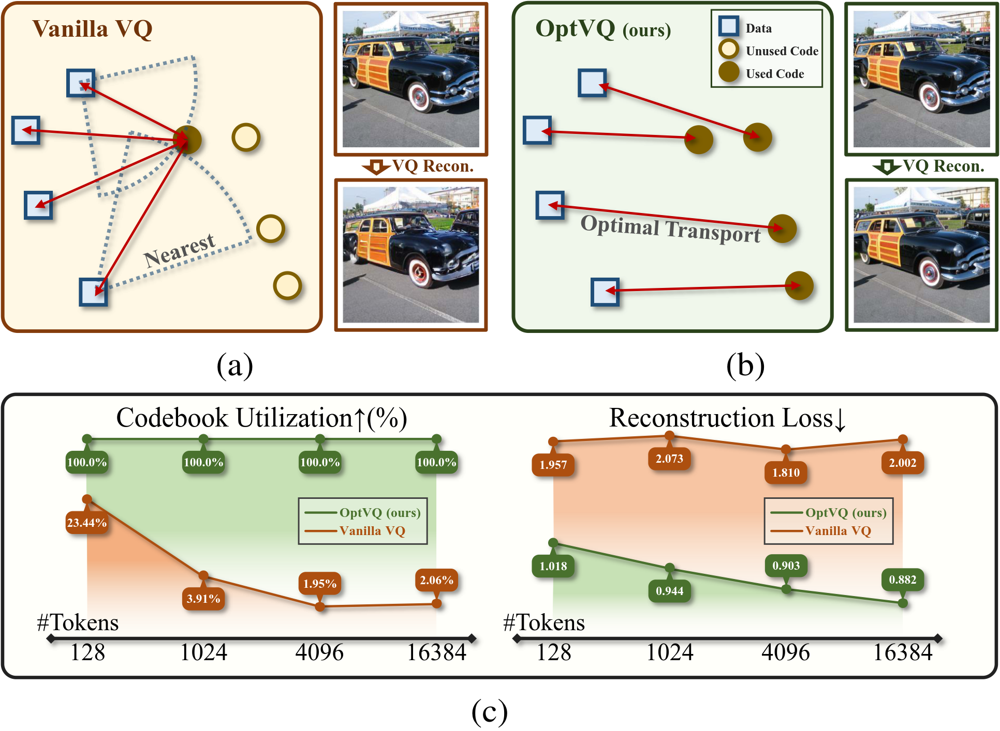
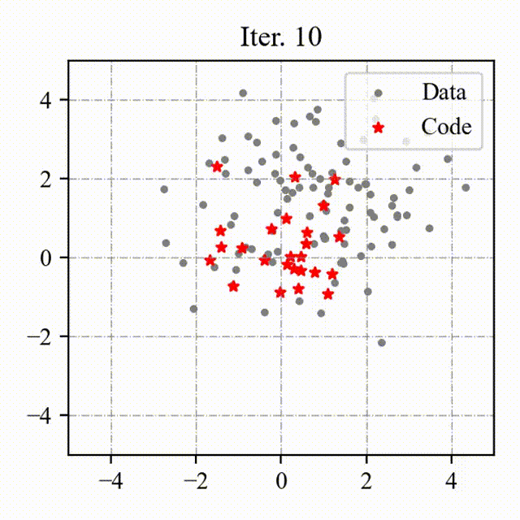
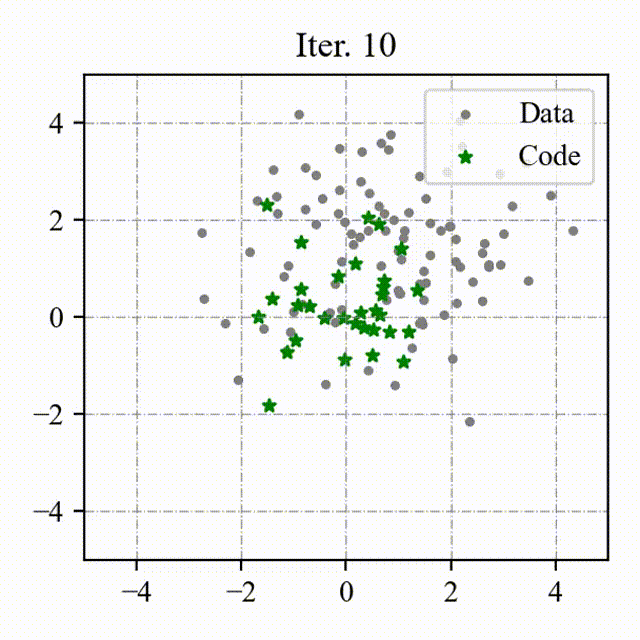

# Preventing Local Pitfalls in Vector Quantization via Optimal Transport 

<p style="color: gray; font-size: 18px; font-weight: bold; text-align: center;">
  Paper | 
  <a href="https://boruizhang.site/OptVQ/" style="text-decoration: none; color: white; background-color: #660874; padding: 4px 8px; border-radius: 8px; border-bottom: none;" target="_blank">Project Page</a>
</p>




## News

| [2024-11-26] Release the pre-trained models of OptVQ.

## Introduction

We conduct image reconstruction experiments on the ImageNet dataset, and the quantitative comparison is shown below:

| Model | Latent Size | #Tokens | From Scratch | SSIM↑ | PSNR ↑ | LPIPS↓ | rFID↓ |
| - | - | - | - | - | - | - | - |
| taming-VQGAN | 16 × 16 | 1,024 | √ | 0.521 | 23.30 | 0.195 | 6.25 |
| MaskGIT-VQGAN | 16 × 16 | 1,024 | √ | - | - | - | 2.28 |
| Mo-VQGAN | 16 × 16 × 4 | 1,024 | √ | 0.673 | 22.42 | 0.113 | 1.12 |
| TiTok-S-128 | 128 | 4,096 | × | - | - | - | 1.71 |
| ViT-VQGAN | 32 × 32 | 8,192 | √ | - | - | - | 1.28 |
| taming-VQGAN | 16 × 16 | 16,384 | √ | 0.542 | 19.93 | 0.177 | 3.64 |
| RQ-VAE | 8 × 8 × 16 | 16,384 | √ | - | - | - | 1.83 |
| VQGAN-LC | 16 × 16 | 100,000 | × | 0.589 | 23.80 | 0.120 | 2.62 |
| OptVQ (ours) | 16 × 16 × 4 | 16,384 | √ | 0.717 | 26.59 | 0.076 | 1.00 |
| OptVQ (ours) | 16 × 16 × 8 | 16,384 | √ | 0.729 | 27.57 | 0.066 | 0.91 |

### Toy Example

We visualize the process of OptVQ and Vanilla VQ on a two-dimensional toy example.
The left figure with red points represents the baseline (Vanilla VQ), and the right figure with green points represents the proposed method (OptVQ).
<p float="left">
  
  
</p>

## Usage

### Installation

Please install the dependencies by running the following command:
```bash
# install the dependencies
pip install -r requirements.txt
# install the faiss-gpu package via conda
conda install -c pytorch -c nvidia faiss-gpu=1.8.0
# install the optvq package
pip install -e .
```

### Inference

Please download the pre-trained models from the following links:

| Model | Link |
| - | - |
| OptVQ (16 x 16 x 4) | [Download](https://cloud.tsinghua.edu.cn/d/91befd96f06a4a83bb03/) |
| OptVQ (16 x 16 x 8) | [Download](https://cloud.tsinghua.edu.cn/d/309a55529e1f4f42a8d2/) |

Then you can write the following code to load the pre-trained model and perform inference:
```python
# Example: load the OptVQ with 16 x 16 x 4
from optvq.utils.init import initiate_from_config_recursively
from omegaconf import OmegaConf
import torch
config = OmegaConf.load("configs/optvq.yaml")
model = initiate_from_config_recursively(config.autoencoder)
params = torch.load(..., map_location="cpu")
model.load_state_dict(params["model"])

# load the dataset
dataset = ... # the input should be normalized to [-1, 1]
data = dataset[...] # size: (BS, C, H, W)

# perform inference
with torch.no_grad():
    quant, *_ = model.encode(data)
    recon = model.decode(quant)
```

Or you can evaluate the pre-trained model on the ImageNet dataset by running the following command:
```bash
python eval.py --config $config_path --log_dir $log_dir --resume $resume --is_distributed
```

### Training

We will release the training scripts soon.

<!-- ## Citation

If you find this work useful, please consider citing it.

```bibtex
xxx
``` -->